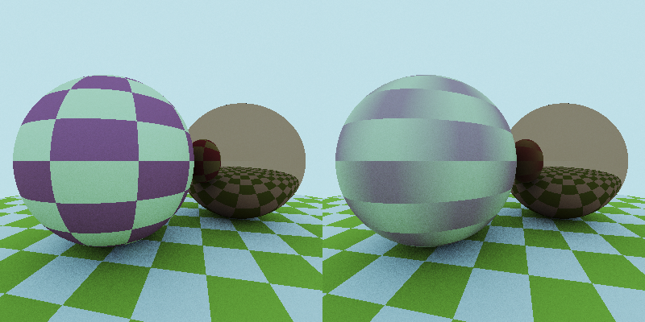

# image-renderer


image-renderer is a C++ tool to generate photo-realistic images.
It is based on the lectures of the _Numerical tecniques for photorealistic image generation_ course ([EN](https://www.unimi.it/en/education/degree-programme-courses/2021/numerical-tecniques-photorealistic-image-generation), [IT](https://www.unimi.it/it/corsi/insegnamenti-dei-corsi-di-laurea/2021/calcolo-numerico-la-generazione-di-immagini-fotorealistiche)), held by [Prof. Maurizio Tomasi](http://cosmo.fisica.unimi.it/persone/maurizio-tomasi/) in 2021.

## Table of contents
- [Requirements](#requirements)
- [Building](#building)
    - [Standard Unix and Windows](#standard-unix-and-windows)
    - [MacOS (Xcode)](#macOS-(Xcode))
- [Usage examples](#usage-examples)
	- [Run a demo of our program with `demo`](#Run-a-demo-of-our-program-with-demo)
    - [Converting a PFM file to a LDR image with `pfm2ldr`](#Converting-a-PFM-file-to-a-LDR-image-with-pfm2ldr)
	- [Image stacking with `stack`](#Image-stacking-with-stack)
- [Contributing](#contributing)
- [License](#license)
- [Acknowledgements](#acknowledgements)
## Requirements

The following software is required to build the project:
* [`cmake`](https://cmake.org/) (version >= 3.12)
* A `C++17` compiler.
* [`libgd`](https://libgd.github.io/), compiled with support for:
	* [`libpng`](http://www.libpng.org/pub/png/libpng.html)
	* [`libjpeg`](https://ijg.org/) or [`libjpeg-turbo`](http://www.libpng.org/pub/png/libpng.html)
	* [`libwebp`](https://developers.google.com/speed/webp/)
	* [`libtiff`](http://www.libtiff.org/)
* [`OpenMP`](https://www.openmp.org)

This project also uses the header-only [`Argh!`](https://github.com/adishavit/argh) library, which is already included in this repository in `include/argh.h`.
Therefore, you do not need to install it on your system to compile `image-renderer`.


## Building

After obtaining the source code (e.g. by cloning from [our GitHub repository](https://github.com/teozec/image-renderer)) you can build the project with `cmake`.

### Standard Unix and Windows

Run the following shell commands from the project directory:

```bash
mkdir build
cd build
cmake ..
make
```

The executable files are generated in the `build` directory.

If you use `bash`, you can enable autocompletion for the program running
```bash
source tools/bash-completion.bash
```
To make it permanent, you can add it to your `~/.bashrc` file.

### macOS (Xcode)

If you wish to use Xcode on your macOS, you can build the project using:

```bash
mkdir build
cd build
cmake -G "Xcode" ..
```
Now that it is all set you can open up the Xcode project built in the `build` directory and compile it from within the IDE.

If you use `bash`, you can enable autocompletion for the program running (from the `build` directory)
```bash
source ../tools/bash-completion.bash
```
To make it permanent, you can add it to your `~/.bashrc` file.

## Basic Tutorial

### A `demo` image
For a quick test, run the following commands from the `build` directory:
```bash
chmod +x ../examples/demo-image.sh
../examples/demo-image.sh
```
and enjoy the `demo.png` file.
The script you have just run contains two of the four actions provided by the program: `demo` and `pfm2ldr`.
The first one renders an example scene, and allows you to conifgure it a bit. For example,
```bash
./image-renderer demo --width=500 --height=500 --antialiasing=9 --angleDeg=30 --nMax=5 --roulette=3
```
will render a 500x500 example scene sampling 9 rays per pixel, rotating the camera by 30 degrees on the z axis and considering at most 5 collisions per ray, starting with the Russian roulette algorithm at 3 collisions.
The antialiasing option is useful to sample each pixel properly, avoiding aliasing. Here an example:


Another example of the `demo` action is
```bash
./image-renderer demo -p orthogonal -R flat -o output.pfm
```
It will generate the `output.pfm` image using an orthogonal camera and a flat rendering algorithm.
As you can see, you can use both long and short options: for a list of all supported arguments, you can always use the `--help` flag.

### Converting a PFM file to a LDR image with `pfm2ldr`
The `demo` action, as well as the `render` and `stack` that we will see later, outputs a pfm file. However, we would like to convert it to a LDR image format, suh ar `png` or `bmp`.
This is the purpose of the `pfm2ldr` action. A quick usage example:
```bash
./image-renderer pfm2ldr --gamma=1.4 demo.pfm
```
will convert `demo.pfm` to the `demo.png` image, using a correction gamma factor of 1.4.
Of course, you can use a different format if you want: supported formats are `bmp`, `gif`, `jpeg`, `png`, `tiff`, `webp`.
```bash
./image-renderer pfm2ldr --format=webp --outfile=output.webp --luminosity=2.0 --quality=50 input.pfm
```
The previous command will convert `input.pfm` to the `output.webp` image, with a total luminosity of 2.0 and a `webp` compression quality of 50.
In particular, the compression quality is a format-dependent argument (different image formats can be configured differently, so make sure to run `./image-renderer pfm2ldr --help` to get all the details).
The luminosity instead is a tricky parameter: it is what the program should consider as the total brightness of the scene. This means that if a higher value is passed, single pixels will be less bright with respect to the total luminosity, making the scene darker! In general, you should let the renderer calculate and use the real total luminosity; however, in some cases the results may not be optimal and this parameter might be needed.

### `render`ing custom scenes
We have seen how to render a demo image. However, that can soon get boring: this is why we have also provided a `render` action.
To see it at work, you can use
```bash
chmod +x ../examples/cornell.sh
../examples/cornell.sh
```
Depending on your PC, this script may take some time, but the result is worth the wait:


The first command in the script makes use of the `render` action, which is used to parse a file describing a scene (or scenefile) and generate a corresponding `pfm` file.
Many arguments are in common with the `demo` action (except for those about the camera, which is now described in the scenefile). Here is an example:
```bash
./image-renderer render ../examples/scene.txt --float="red:0.3"
```
renders the scene described in `../examples/scene.txt` assigning a custom value to the red variable that appears in the file.
If you wish to learn how to make your own scenefiles, `scene.txt` contains a basic tutorial.

### Image `stack`ing
Finally, you'd have surely noticed that there is another action in the `cornell.sh` script: `stack`.
It is used to stack many noisy images to get a better looking one by increasing the signal to noise ratio.


For example, if you want to stack 10 images saved as "image00.pfm", "image01.pfm" and so on, you can simply run:
```bash
image-renderer stack image*.pfm
```
This way you will get a "stack.pfm" image in current directory.
You can choose between `mean`and `median` stacking, and also apply sigma-clipping providing a `alpha` factor: for more info please run `image-renderer stack --help`
This action is very powerful: as a matter of fact it is not only used to get a better signal to noise ratio, but also for rendering blurry images. Here an example:



## Contributing

If you find any problem or wish to contribute, please open an issue or a pull request on [our GitHub repository](https://github.com/teozec/image-renderer). Thank you!


## License

image-renderer is free software, and it is released under version 3 of the [GNU General Public License](https://www.gnu.org/licenses/gpl-3.0.html).

## Acknowledgements


 
 

...and many more to come!
